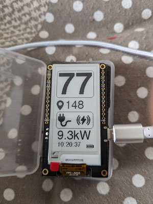

# Lilygo_T5_Epaper_RenaultZE

Ce dépot contient le code permettant d'afficher les informations concernant la batterie d'un véhicule RenaultZE sur une board ESP32 [Lilygo DEPG0213BN](https://www.lilygo.cc/products/t5-v2-3-1) à encre électronique.



Pour pouvoir utiliser les informations de votre véhicule, vous devez avoir un compte myRenault.

Vous devez paramétrer le fichier [TOCUSTOMIZE.h](./include/TOCUSTOMIZE.h) avec vos informations (myRenault + Wifi). Dans ce fichier vous pouvez aussi paramétrer l'interval de réveil de la carte.

Pour paramétrer la partie RenaultZE API vous pouvez utiliser le projet [renault-api](https://github.com/hacf-fr/renault-api).
Utilisez les lignes de commandes suivantes :
```
$ pip install renault-api[cli]
$ renault-api --log status
```
Ensuite, parcourez le fichier .credentials/renault-api.json pour récupérer vos valeurs

## Licence

Ce projet est distribué sous la licence GNU General Public License v3.0. Pour plus de détails, veuillez consulter le fichier `LICENSE` dans ce dépôt.

Au cours de ce projet j'ai utilisé différents outils :

https://javl.github.io/image2cpp/

https://rop.nl/truetype2gfx/

Et les icônes proviennent de :

[Ev icons created by juicy_fish - Flaticon](https://www.flaticon.com/free-icons/ev)

[Wireless charging icons created by Pixel perfect - Flaticon](https://www.flaticon.com/free-icons/wireless-charging)

[Plug icons created by Gregor Cresnar - Flaticon](https://www.flaticon.com/free-icons/plug)

## Contribution

Les contributions à ce projet sont les bienvenues. Si vous souhaitez contribuer, veuillez suivre les directives de contribution standards pour les projets GitHub.

## Support et Contact

Pour le support ou pour entrer en contact, veuillez ouvrir un ticket dans la section issues du dépôt GitHub.
